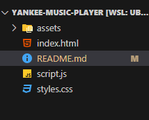

# Yankee Music Player
Yankee Music Player is a sleek and responsive web music player that integrates the YouTube API to fetch and play songs. It includes search functionality, session-based favorites, and shuffle mode.
## Features

- **Trending Music**: Fetches songs from YouTube.
- **Search Functionality**: Find and play any song using YouTube's search.
- **Dynamic Background**: Updates to match the current album cover.
- **Favorites System**: Add/remove songs from a session-based favorites list.
- **Shuffle Mode**: Randomly plays songs within the same genre.
- **Interactive UI**: A smooth, user-friendly design with hover effects.

## Screenshots


## Tech Stack

- **Frontend**: HTML, CSS, JavaScript
- **API**: YouTube Data API

## Folder Structure


## Installation & Setup

1. Clone the repository:

   ```bash
   git clone https://github.com/Wachira-alt/Yankee-Music-Player.git
   cd Yankee-Music-Player


## Usage

- Click on a song to **play it**.
- Use the **search bar** to find a song.
- Click the ❤️ button to **add a song to favorites**.
- Click the **shuffle button** to play a random song from the same genre.


